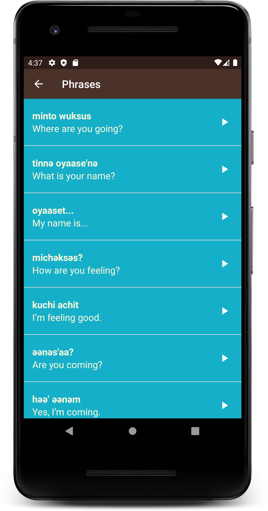

# Miwok App

This app displays lists of vocabulary words for the user to learn the Miwok language. Divided according to categories this app also contains images and the pronunciations of the Miwok words.\
Built as a practice app for Udacity's Android:Basics-Multiscreen Apps.\
[https://classroom.udacity.com/courses/ud839] - Link to the course

The minimum API Level of the app is 15 which means that only AVDs or Android Devices with API Level 15 or above or Android Version 4.0.3 or above will support the app.

## How to directly install the app in your android device?
* [app-debug.apk](https://github.com/jayesh-srivastava/Miwok-android/blob/master/apk%20file/app-debug.apk)\
Click on the above link and click on 'view raw'. You might have to grant some initial permissions to install an app from an unknown source. Install and open.

### Developed by  [@jayesh-srivastava](https://github.com/jayesh-srivastava)

&ensp; &ensp; &ensp; 
