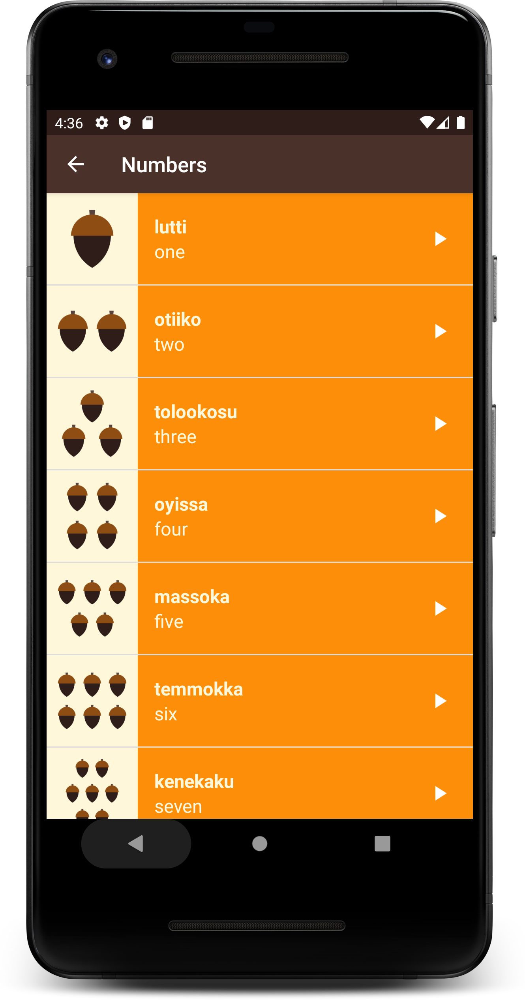
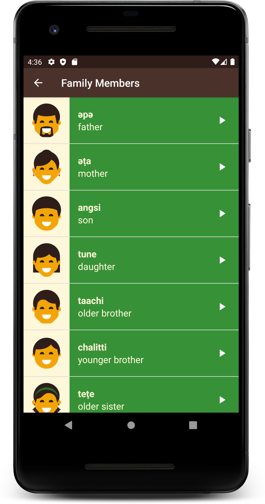

# Miwok App

This app displays lists of vocabulary words for the user to learn the Miwok language.\
Built as a practice app for Udacity's Android:Basics-Multiscreen Apps.\
[https://classroom.udacity.com/courses/ud839] - Link to the course

The minimum API Level of the app is 15 which means that only AVDs or Android Devices with API Level 15 or above or Android Version 4.0.3 or above will support the app.

## How to run the app in your system?
Clone the repository in your local machine and import the project into your latest version of Android Studio.
Choose the 'app' option in the 'run/debug configurations dialog' and run it in an Android Virtual Device which has an API Level 15 or
above.

To run the application in a RealWorld Android Device - Enable Developers Options in your Device(Click on Build number several times), followed by enabling USB Debugging. Connect your system to your device via an USB. In Android Studio, choose the target device as your device's name in the available devices dialog and click on run.

## How to directly install the app in your android device?
* [app-debug.apk](https://github.com/jayesh-srivastava/Miwok-android/blob/master/apk%20file/app-debug.apk)
Open github from your android device, search for my github profile 'jayesh-srivastava' in the all github and open the Scorer-android repository. Scroll down to the readme file and click on the above link and click on 'view raw'. The app will be downloaded in your android device.

### Developed by  [@jayesh-srivastava](https://github.com/jayesh-srivastava)

&ensp; &ensp; &ensp;
